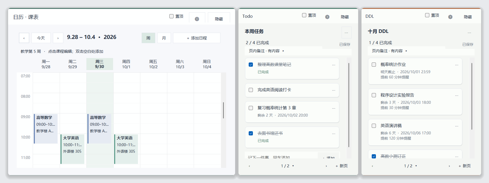

# 桌面课笺 1.5.1

本地 Windows 桌面应用，包含可同时显示的日历、Todo 和 DDL 三个独立组件，以及统一设置中心。数据只保存在本机，不联网。



- **介绍页**：<https://elinama500.github.io/DeskStudy/>
- **下载**：在 [Releases](https://github.com/ElinaMa500/DeskStudy/releases/latest) 页面下载 `DeskStudy-1.5.1-Windows.zip`，解压后双击 `DeskStudy.exe`。
- **使用指南**：[USER_GUIDE.md](USER_GUIDE.md)（压缩包内为 `使用指南.html`）。
- **五种便签外观**：[LAYOUTS.md](LAYOUTS.md)。

## 启动与升级

从源码构建时，程序输出到 `release-1.5.1` 文件夹，分发包为项目根目录的 `DeskStudy-1.5.1-Windows.zip`（由 `package.ps1` 生成）。解压后双击其中的 `DeskStudy.exe` 即可，无需安装或管理员权限。请保留程序同目录的 `DeskStudy.exe.config`。运行环境为 Windows 10/11 与 .NET Framework 4.8 或更新版本。

第一次使用是空白课表和两本各有一页的便签。应用不连接云端，也不读取 Outlook。

从旧版升级时，先从旧程序的托盘菜单选择「保存并退出」，再启动 1.5.1。各版默认使用同一个本地数据目录。首次读取 1.0 数据会保留 `migration-v1-*.json`；读取尚无便签布局字段的 1.1 数据会保留 `migration-notebook-layouts-*.json`；1.2、1.3、1.4、1.5 数据可直接读取。不要用旧版再次读写已升级的数据；需要回退时使用升级前的备份。开发目录保留旧构建，本版使用 `release-1.5.1`。

选用 1.3 新增的「清爽卡片」或「手账纸页」后，数据会标记为 1.3 格式：1.2 打开时会提示「不支持此数据版本」并退出，数据保持不变。切回前三种布局后，1.2 可以再次读取。

1.4 加入截止时间面板和"只有日期"的截止时间（见下文「Todo 与 DDL 便签」）。1.3 能读取 1.4 的数据，但不认识"只有日期"的标记：这类任务在 1.3 里会显示为当天 23:59，用 1.3 保存后标记丢失。

1.5 加入桌面组件模式（见下文「桌面组件」），升级后默认启用。旧版保存的窗口位置含系统标题栏，首次启动时会换算一次，让内容区域保持原来的位置和大小。1.4 能读取 1.5 的数据，但不认识窗口模式，窗口会比原来略小。

1.5.1 加入拖动贴齐、越界弹回和组件之间不重叠（见下文「两种模式通用」），首次启动时会把超出屏幕或互相重叠的组件整理一次。日历外观跟随便签布局：轻量卡片／清爽卡片用清爽风格，纸页本／手账纸页用纸页风格（单行导航、单行星期、圆角课程块、更矮的顶部与最小高度），原始外观保持原样；日历背景也随布局默认色。新增工作周视图并记住上次视图；新用户首次打开时日历高度刚好显示 07:00–12:00（屏幕放不下则缩小）；工作周另存为 `Calendar.WorkWeek`，`DefaultView` 仍只写 `Week`／`Month`，1.5 可正常读取（显示为整周）。清爽卡片与手账纸页的底部翻页行更矮，便签最小高度随之降低。

1.2 加入三种可切回的便签布局，1.3 按参考样式再加入两种，共五种。详细操作、兼容规则与验证记录见 `LAYOUTS.md`、`VERIFICATION.md`；分阶段记录见 `DEVELOPMENT.md`。测试和截图使用隔离数据，首次启动仍是空白课表与便签，升级时恢复自己的内容。

## 五种便签布局

打开任一组件的齿轮 →「外观」→「便签布局」，点击原始外观、轻量卡片、纸页本、清爽卡片或手账纸页。两本便签同步切换，当前页面各自保留，选择自动保存；关闭设置中心后提醒继续运行。

| 布局 | 操作与特点 |
| --- | --- |
| 原始外观 | 恢复顶部翻页列表、标题框、创建日期、文字区以及每项任务的编辑／移动／删除按钮。 |
| 轻量卡片（默认） | 点击页标题直接改名；任务列表末尾输入并按回车连续添加；任务右侧 ⋯ 可编辑截止时间、移动或删除；「页内备注」展开完整文字；底部翻页、点页码进入目录、＋新页。 |
| 纸页本 | 同样的操作，加上暖纸色、页边线和可滚动的侧边页码；页码再多也不增加窗口大小。 |
| 清爽卡片 | 白底；顶部只有圆点名称（如「Todo · 待办本」）、「置顶」和小 ⚙，鼠标移上时出现 ✕ 用于隐藏；大号页标题下显示创建日期与完成数；任务之间细线分隔；DDL 显示「明天 23:59 · 9/28 · 提前 45 分钟」；页内备注在列表下方；底部「‹ 第 1 / 2 页 ›」与「+ 新一页」。 |
| 手账纸页 | 与清爽卡片功能相同，米色纸页、顶栏细线和左侧窄页签（01、02…），页数多时页签可滚动。 |

布局决定结构与默认风格；自定义字号、颜色和透明度仍按全局／单组件优先级生效。切换不会清空个性设置。旧配置中已存储的颜色等值会保守保留，包括与旧默认相同的值；想使用新布局的默认配色，可在「外观」恢复相应范围默认外观。

标题和页内备注自动保存。快速添加行中的文字在布局切换及翻页时保留，按回车或「＋添加」后才成为正式任务；尚未提交的快速输入不跨应用退出保存。中文组合输入期间暂缓视觉切换，输入结束后应用最终选择。

## 桌面组件

默认是**桌面组件模式**：

- 组件没有系统标题栏，不出现在任务栏、Alt+Tab 和 Win+Tab 里。拖动顶栏移动，拖动边缘或四角调整大小。窗口阴影与 Windows 11 的圆角由系统提供；Windows 10 为直角。
- 点击组件时它浮到前面；切换到其他程序后，它自动回到所有窗口下面。勾选「置顶」的组件不受影响。组件自己的面板、菜单和对话框打开时不会沉底。
- 单击托盘图标，或按全局快捷键（默认 `Ctrl+Alt+Shift+D`，可在「显示与布局」修改或停用），把正在显示的组件浮到前面；在组件处于前面时再按一次快捷键，收回去。被隐藏的组件不会因此出现；双击托盘图标显示全部组件。
- 点击「隐藏」只隐藏该组件，提醒继续在托盘运行。清爽卡片与手账纸页的顶栏在鼠标移到组件上时显示 ✕。
- 手动启动时组件出现在前面；由 Windows 登录自动启动（启动命令带 `--startup`）时，组件在其他窗口下面出现，并把键盘焦点留给原来的窗口。启用开机启动后，每次运行会把启动项更新为当前程序路径。
- 按 Win+D 显示桌面时，组件可能和其他窗口一起被收起；单击托盘图标或按快捷键可叫回。
- 在「显示与布局」→「窗口模式」可切换为**标准窗口**：带系统标题栏和任务栏按钮的普通窗口。切换时内容区域保持原位置和大小。

两种模式通用：

- 拖动和拉伸过程中窗口完全跟随鼠标，松手后才整理（1.5.1）：
  - 离屏幕边缘或其他组件 10 像素以内时贴齐，组件之间留 5 像素间隙。
  - 超出屏幕顶部总是滑回；超出左、右、下边（含任务栏）不超过 100 像素时滑回边缘，超出更多则留在原处，但至少保留 100 像素在屏幕内。
  - 压住其他组件时，只有刚拖动的组件滑到最近的空位。重叠面积超过较小组件的一半 时视为有意叠放，保持不动（拉伸时也不受该组件阻挡）。拉伸边缘撞到其他组件时，该边停在它之前。
  - 首次启动、「恢复默认布局」和「找回当前屏幕」把日历放在左上，两本便签沿右侧排开，不再层叠。
  - 设置中心输入的坐标、恢复／重置布局、重新显示组件、切换窗口模式、屏幕分辨率变化和启动时，按同样的屏幕边缘与不重叠规则整理（不做 10 像素贴齐）。锁定位置的组件保持不动。实在放不下时（屏幕太小）允许重叠。
- 折叠（1.5.1）：顶栏 ⚙ 右边的 ⌄ 或双击顶栏，把组件收成顶栏并贴在工作区底边（任务栏上方）；正下方被占时沿底边滑到最近空位，折叠条只能沿底边左右移动，可贴齐左右屏幕边缘，不能调整大小。⌃ 或再次双击展开，回到折叠前的位置和大小（若该处已被占用则按不重叠规则让开）。折叠不保存：保存的始终是展开时的位置，重启后全部展开。
- 每个组件的位置、尺寸、置顶和显示状态独立保存。「置顶」仅控制当前组件。开启位置锁定后，不能通过拖动或边缘缩放改变布局，仍可在设置中心修改。
- 点击任一组件的齿轮按钮，或右键系统托盘图标选择「设置中心」。设置中心是带任务栏按钮的独立窗口，关闭它不会关闭组件或提醒。
- 完全退出使用托盘菜单「保存并退出」。重新启动时恢复布局、显示状态和当前页面；如果全部隐藏，可用托盘重新显示。

## 设置中心

| 页面 | 可以管理的内容 |
| --- | --- |
| 组件总览 | 日历、Todo、DDL 的显示／隐藏、快速定位，以及全部显示／隐藏。 |
| 显示与布局 | 窗口坐标、尺寸、置顶、位置锁定；保存与恢复自定义布局、恢复默认布局、将全部组件找回设置中心所在屏幕。 |
| 外观 | 全局或单组件的浅色／深色主题、背景色、不透明度和字号；恢复跟随全局或恢复默认外观。 |
| 日历与课表 | 日历视图（工作周／周／月，也会记住组件上的选择）、一周起始日、学期范围、教学第 1 周起点，以及课程与整个循环系列的增删改。 |
| 便签与页面 | 两本便签的名称，页面新建、重命名、上移／下移、归档／取消归档，以及各便签桌面当前页。 |
| 提醒 | 新任务的默认提前分钟数、免打扰时段、声音、测试通知，以及两本便签所有页面的未完成截止任务。 |
| 数据与应用 | 自动保存延迟、导入／导出、立即备份、备份恢复、最近备份时间和 Windows 登录后启动。 |

外观调整会实时预览，合法设置更改自动保存。组件端的隐藏、拖动、置顶和翻页，也会同步回设置中心。

单组件默认跟随全局。需要单独调整时，在「外观」选择该组件，取消勾选「跟随全局外观」；重新勾选会移除独立覆盖。重置外观或布局只改变显示设置，保留课表、任务、完成状态和历史页面。

窗口不见时，打开「显示与布局」选择「将组件找回当前屏幕」，会同时找回并显示三个组件；「快速定位」只找回选中的一个。

## 日历与课表

周视图按时间排列课程，工作周视图只显示周一到周五（1.5.1），月视图用于查看全月安排。日历记住上次选的视图。使用上一段、下一段和今天浏览日期，点击「新建日程」录入名称、日期、开始／结束时间、地点、备注和颜色。点击现有日程可修改或删除。

先在设置中心填写学期日期与教学第 1 周起点，新课程即可使用这些默认值。每周或每两周循环均可选择一周中的多个日期，起止范围包含当天。双周课程按课程保存的教学周基准计算；修改全局学期默认值不会自动改写已有课程。已有课程仍可在编辑器中调整循环规则。

从桌面日历修改或删除循环课程时，可以选择「仅这一次」或「整个系列」。单次取消或调课保存为例外，不改变其他课次。设置中心的课程列表管理整个系列；临时停课请回到桌面日历选择对应课次。

修改系列会保留原有单次例外；如果调整了起始日、上课星期或循环周期，不属于新规则的旧例外不显示。单个日程不跨午夜，跨午夜安排需要拆为两条。

课程保存当地日期、上课时间和创建时的 Windows 时区，不以固定 UTC 时长计算下一次，因此夏令时切换前后的 09:00 课程仍显示 09:00。DDL 也保留设置时的时区。夏令时中不存在的时间向后移至首个有效分钟；重复出现的时间使用较晚的 UTC 时刻。跨时区旅行时，课表仍显示录入时的当地课表时间。

## Todo 与 DDL 便签

两本便签功能一致，名称、页面和桌面当前页互相独立。

- 页面包含标题、创建日期和普通文字区，文字自动保存。
- 任务可以编辑、删除、调整顺序、勾选完成和取消勾选；完成后仍保留，方便回顾。
- 「新建页」创建空白页，旧页面的文字、任务顺序与完成状态全部保留。
- 使用上一页、下一页或页面列表翻页，当前页会在重启后恢复。
- 在设置中心的「便签与页面」管理全部页面，包含归档页。归档页从桌面翻页列表中收起，其内容与提醒均保留。
- 归档当前页面时，会切换到其他未归档页；如果没有可用页面，会创建一张空白页。取消归档可恢复到翻页列表；对归档页点击「显示在桌面」会取消归档并选中该页。
- 截止时间通过同一个面板设置：DDL 便签添加任务时按回车弹出；点任务下方的状态文字（如「未设置截止时间」）可随时修改；Todo 任务在鼠标悬停时出现「+ 截止时间」。面板内方向键选日期、Enter 完成、Esc 或点面板外取消，并提供上次用过的日期和时间。
- 只选日期的截止时间按当天 23:59 计算逾期，显示为日期，在当天的固定时间（默认 09:00，可在「提醒」页修改）提醒一次，不再在 23:59 提醒；当天该时间之后才设置的不补发。
- 选了具体时间的任务可设置提前分钟数。提前时间为 0 时只在截止时提醒；没有截止日期的任务不提醒。设置中心的默认提前时间仅应用于新任务。`⋯` 菜单里的完整编辑对话框仍可修改任务文字和全部时间设置。

## 提醒、免打扰与声音

应用每 5 秒检查两本便签的所有页面，正常提醒可能有最多约 5 秒延迟。隐藏组件、翻页或归档页面，都不会取消未完成任务的提醒。每个任务在提前时间和截止时间各提醒一次，完成后不再触发后续提醒；已发送的系统通知和历史记录不会自动撤回。

「提醒」页集中展示所有未完成且设置了截止时间的任务，包含归档页，并标注临近截止或已逾期。双击任务可打开所在页面。

免打扰使用电脑当前当地时间，支持跨午夜时段，例如 22:00—08:00。起止时间相同表示全天免打扰。免打扰期间推迟通知，不消耗任务的提醒机会；结束后汇总待发提醒。声音开关控制应用请求的通知声音。「发送测试通知」不受应用内免打扰限制，Windows 自身的勿扰设置仍然有效。

休眠或完全退出时无法即时通知；恢复运行后会汇总遗漏提醒并写入提醒中心。如果提前时间和截止时间均已错过，只补发截止提醒。提醒中心保留最近 2,000 条记录，这个上限不删除任务或完成记录。

系统通知使用 Windows 托盘通知接口。横幅、通知中心和实际声音受 Windows 通知设置、勿扰与系统策略影响。需要实时提醒时请保持托盘运行，或在「数据与应用」启用登录 Windows 后自动启动。

## 数据、备份与开机启动

默认数据目录为 `%LOCALAPPDATA%\DeskStudy`，即当前 Windows 用户的本地应用数据文件夹。设置中心会显示完整路径。

| 文件 | 用途 |
| --- | --- |
| `data.json` | 课表、便签、所有页面与任务、提醒状态、设置和窗口布局。 |
| `data.previous.json` | 上一次成功保存的数据，通过临时文件与原子替换写入。 |
| `backup-*.json` | 点击「立即备份」创建的本地备份。 |
| `before-import-*.json` | 每次导入或恢复前保留的当前完整数据，包含尚在内存中的最新编辑。 |
| `migration-v1-*.json` / `migration-notebook-layouts-*.json` | 旧版数据升级前的原始备份。 |

「导出全部数据」将完整内容保存到指定 JSON 文件，可复制到其他电脑后导入。导入和恢复会替换当前课表、便签、设置及布局；应用会先验证文件并创建当前数据的安全备份，再执行替换。恢复后桌面组件与已打开的提醒历史窗口同步更新。无效或不支持的未来版本文件不会覆盖当前数据。「最近备份」显示备份记录的时间，可在同页选择备份恢复。

自动保存始终开启，可选择编辑后约 0.45 秒、1 秒或 2.5 秒保存，正常退出立即保存。磁盘不可写时会提示错误并保留内存内容，可导出到其他可写位置。数据文件上限为 32 MB。

开机启动仅为当前 Windows 用户设置，在登录后启动程序，无需管理员权限。取消勾选即可移除。便携版启用后请保持程序路径不变；移动程序后，在新位置重新切换一次开关以更新路径。

## 从源码构建与测试

源码位于 `src`，采用 C# 5、WinForms 和 .NET Framework 类库，没有第三方运行依赖。

```powershell
powershell -ExecutionPolicy Bypass -File .\build.ps1
```

默认输出为 `release-1.5.1\DeskStudy.exe`。测试脚本位于 `tests`，实际通过情况见 `VERIFICATION.md`。

开发测试可使用 `DeskStudy.exe --data-dir "完整测试目录"` 隔离数据，不影响正式数据。隔离数据模式不会实际修改 Windows 开机启动项；开关仅保存测试偏好。

系统接口参考：[Microsoft .NET Framework 安装说明](https://learn.microsoft.com/en-us/dotnet/framework/install/)、[NotifyIcon.ShowBalloonTip](https://learn.microsoft.com/en-us/dotnet/api/system.windows.forms.notifyicon.showballoontip?view=windowsdesktop-8.0)。

## 许可证

本项目以 [MIT 许可证](LICENSE) 开源。

