# DeskStudy user guide

[中文版](USER_GUIDE.md)

DeskStudy keeps three small widgets on your Windows desktop:

- **Calendar**: your timetable by work week, week or month. It handles courses that repeat every week or every two weeks, all-day events, and can show your Outlook calendar.
- **To-do**: things to do; tick them off when done.
- **Deadlines**: things with a due time. They are sorted by due time, remind you before they are due, and appear on the calendar.

Everything stays on your computer and there is no account. DeskStudy does not go online, except to download your Outlook calendar if you subscribe to one.

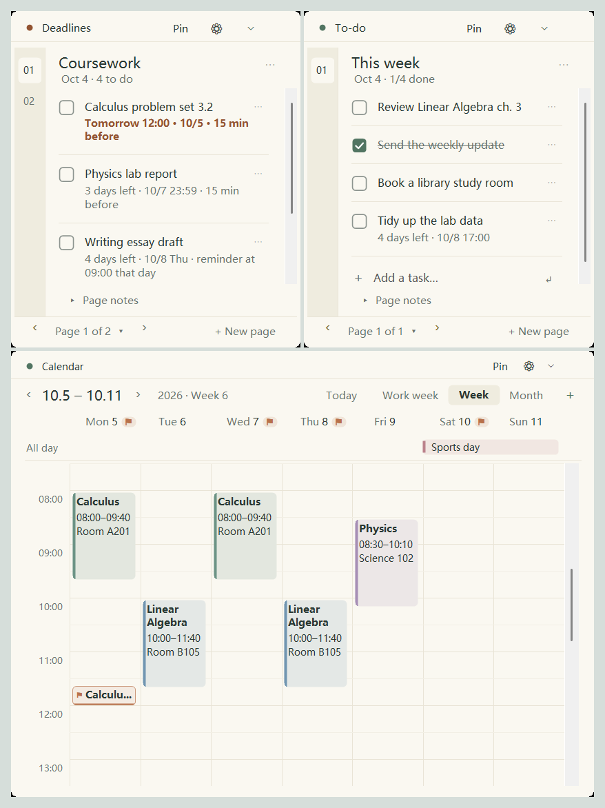

---

## 1. Install and start

1. Unzip the download into a folder that stays put, e.g. `D:\DeskStudy`. Do not run it from inside the zip.
2. Double-click `DeskStudy.exe`. There is nothing to install and no administrator rights are needed.
3. The first time, the calendar and both notebooks are empty: just start adding things.

- Windows 10 or Windows 11 is required.
- If Windows shows "Windows protected your PC", choose **More info → Run anyway**. The program is not code-signed; the warning does not mean anything is wrong.
- Keep `DeskStudy.exe.config` in the same folder as `DeskStudy.exe`.
- To start DeskStudy with Windows: **Settings → Data and app → Start when I sign in to Windows**.
- The interface follows your Windows display language the first time. To switch later, see section 7, Appearance and language.

---

## 2. Working with the widgets

### Move and resize

- **Move**: drag the strip along the top of a widget.
- **Resize**: drag an edge or a corner.
- **Tidying up when you let go.** While you drag, the widget follows the mouse exactly. When you let go:
  - **Snap**: within 10 pixels of a screen edge or another widget, it snaps to it, leaving a 5-pixel gap between widgets.
  - **Slide back**: past the top of the screen it always slides back. Slightly past the left, right or bottom edge (including the taskbar) it slides back too. Pushed further, it stays there, but part of it always remains on screen so you can drag it back.
  - **Move aside**: dropped onto another widget, the one you moved slides to the nearest free space. If it covers more than half of the smaller widget, DeskStudy assumes you stacked them on purpose and leaves them.
- Positions and sizes are remembered.

### Hide, fold, pin

- **Hide**: the ✕ in the top-right corner (the **Hide** button in the Original layout). The program and its reminders keep running.
- **Fold**: the ⌄ next to ⚙, or double-click the header. The widget folds into its header bar at the bottom of the screen, above the taskbar. Use ⌃ or double-click again to unfold it where it was. Widgets always start unfolded.

  

- **Pin**: keeps that widget above other windows.

### Widgets stay behind your other windows

Click a widget and it comes to the front. Switch to another program and it goes back behind (pinned widgets excepted). To bring the widgets forward:

- Click the **DeskStudy** button on the taskbar; click it again to send them back. Right-click it and choose **Pin to taskbar** to start DeskStudy from there next time.
- Click the DeskStudy icon in the notification area (system tray). Double-click it to show any hidden widgets too.
- Press `Ctrl+Alt+Shift+D`; press again to send them back. Change or turn off the shortcut under **Settings → Display and layout**.

Prefer ordinary windows? **Settings → Display and layout → Window mode → Standard windows** gives each widget a title bar and its own taskbar button.

### Also

- **Open Settings**: click ⚙ on any widget, or right-click the tray icon → **Settings**.
- **Quit**: right-click the tray icon → **Save and exit**. If the icon is hidden, click `^` at the right of the taskbar first.

---

## 3. Calendar

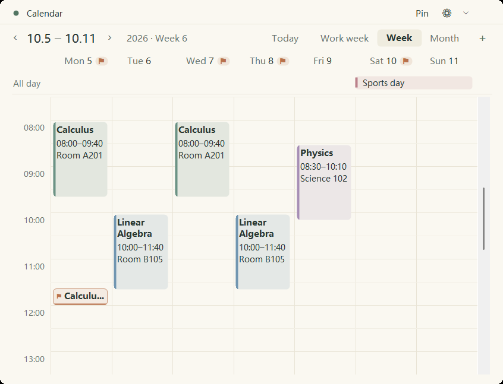

### Viewing

- Switch between **Work week** (Monday to Friday, wider columns), **Week** and **Month** at the top right. The calendar remembers your choice.
- `‹` and `›` move a week (or a month) back and forward; **Today** jumps back to today.
- In the week views, event names are shown in full and wrap onto further lines. When a block is too narrow, hover over it to read everything.

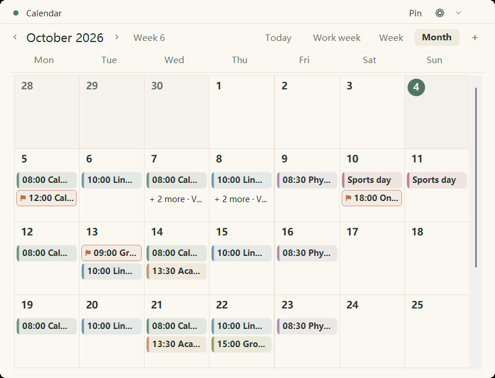

### Adding and changing events

1. Double-click an empty time slot, or click **＋** at the top right.
2. Fill in the name, date, time, location and notes, and pick a color. The color list offers six presets, the colors other events already use (shown as **Same as "…"**), and **Custom color…**.
3. For a course that runs every week, set **Repeat** to **Every week** or **Every two weeks**, tick its weekdays, and set **Repeat until**.

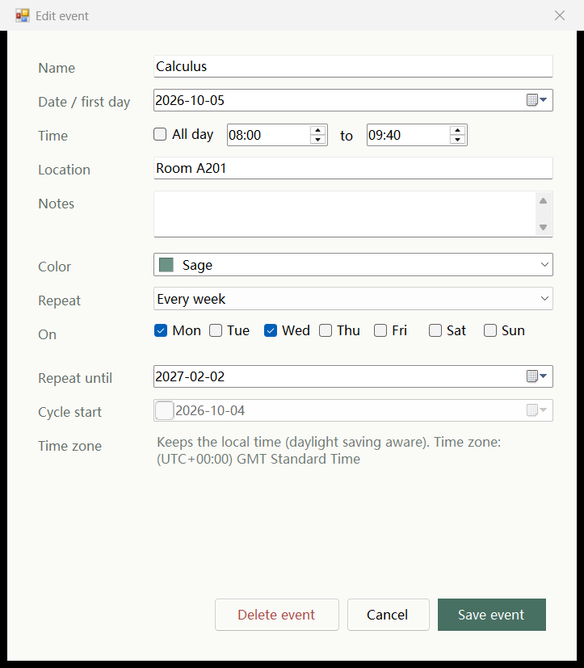

- Click an event to change or delete it. For a repeating course you choose **Only this one** or **The whole series**; use **Only this one** for a cancelled or moved class.
- Set your term dates and teaching week 1 under **Settings → Calendar** first: new courses then repeat until the end of term, and the calendar shows the teaching week.

### All-day events

For holidays, sports days or exam weeks:

- In a week view, double-click a date to add an all-day event on that day, or tick **All day** in the editor and choose how many days.
- All-day events appear in the **All day** row under the dates, as one bar across the days they cover; an event that runs into the next week continues there.
- All-day events can repeat every week or every two weeks as well.

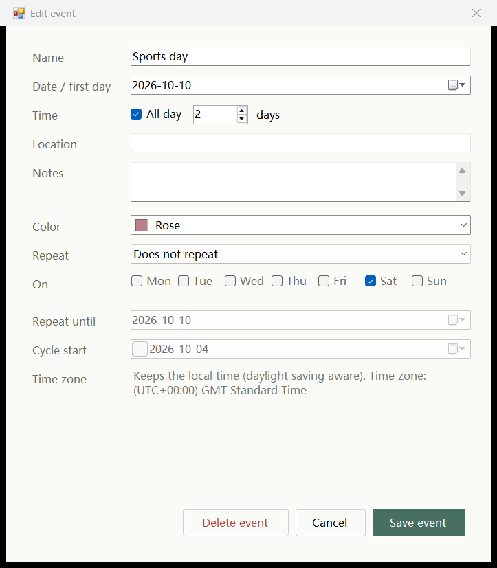

### Deadlines on the calendar

- Unfinished deadlines with a due time appear on the calendar as small ⚑ tags whose bottom edge is the due time. Deadlines very close together share one tag, "⚑ N due".
- Every day with deadlines gets a ⚑ badge next to its date, with the number when there are several. Hover over it to see them.
- Click a deadline: the Deadlines notebook opens that page and highlights the task. Double-click: its editor opens.
- To hide them: **Settings → Calendar → Show deadlines on the calendar**.

---

## 4. Your Outlook calendar

A Microsoft 365 calendar (school or work) can be shown read-only in DeskStudy.

**Step 1: get the link in Outlook**

1. Open Outlook on the web and go to **Settings → Calendar → Shared calendars → Publish a calendar**. (This is not the "Share" option that invites people.)
2. Choose your calendar and **Can view all details**, select **Publish**, and copy the **ICS** link.

**Step 2: add it to DeskStudy**

**Settings → Calendar → Outlook calendar (read-only)**: paste the link into **ICS link** and click **Save and sync**. After a few seconds the card shows the last sync time and the number of events.

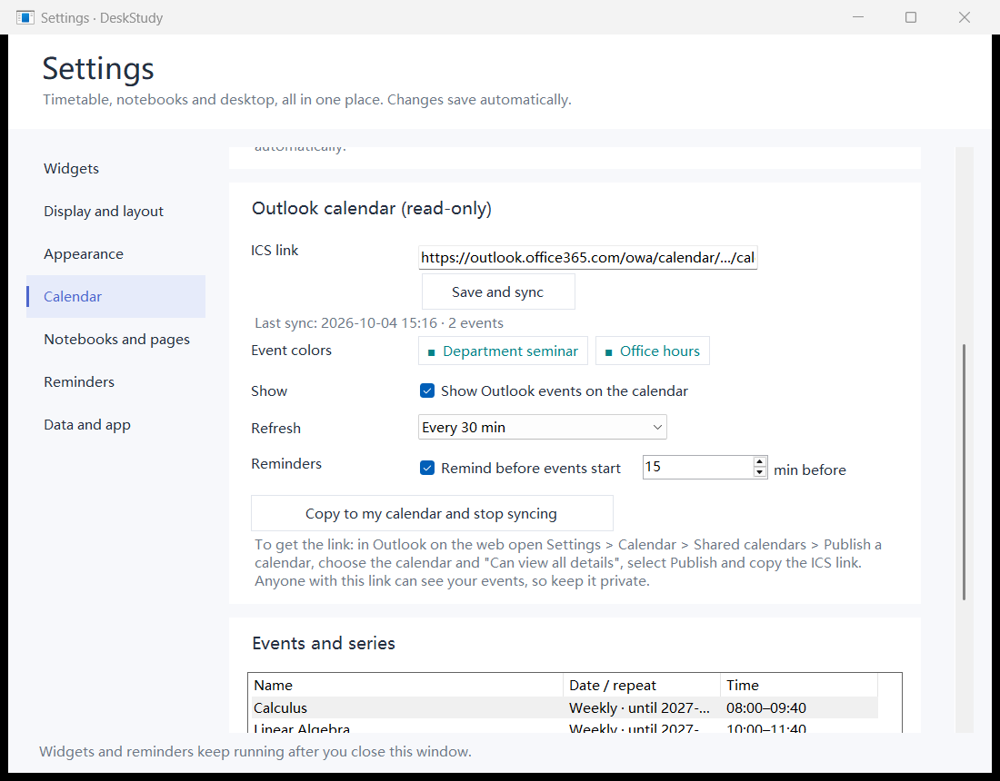

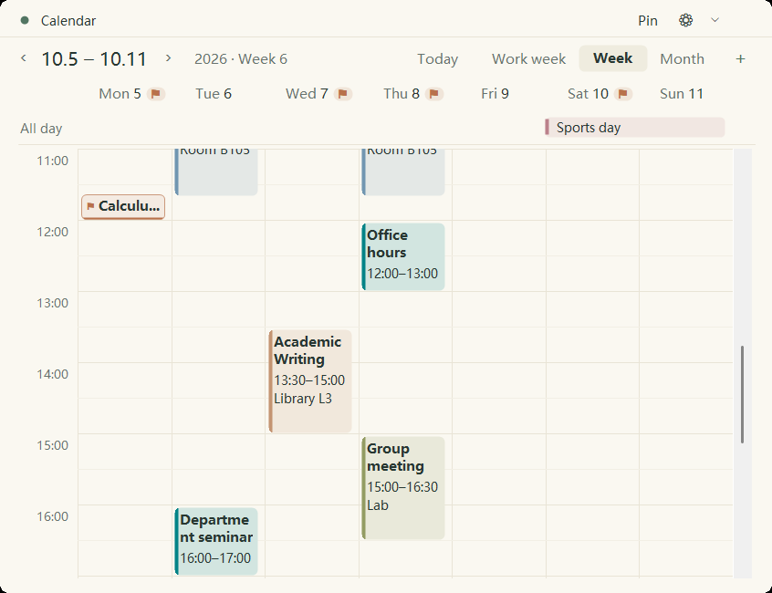

- **Colors**: published Outlook calendars carry no colors, so DeskStudy gives each event name its own color; events with the same name share it. To match Outlook, click a swatch under **Event colors**, or click the event on the calendar and choose **Change this event's color…**.
- **Read-only**: Outlook events cannot be changed here; clicking one shows its details. Change them in Outlook.
- **Refresh**: every 30 minutes by default (15, 60 or 120 also possible). Changes made in Outlook appear once Microsoft updates the published calendar, which can take a while.
- **Reminders**: 15 minutes before an event starts by default; change or turn off under **Remind before events start**.
- **Offline**: the last synced calendar stays on screen.
- **Keep the link private**: anyone with it can see your calendar.

**Turning Outlook events into your own**
**Copy to my calendar and stop syncing** first tells you how many recurring and single events it will create, then:
- Weekly classes become repeating courses, with the weeks off left out.
- One-off changes and irregular events become single events.
- All-day events stay all-day, and colors are kept.

A backup is made first. Afterwards syncing stops and the Outlook calendar is no longer shown. Only the synced range is copied (35 days back to 200 days ahead), so set the colors you want before copying.

---

## 5. To-do and Deadlines

The two notebooks are separate: **To-do** for things to do, **Deadlines** for things with a due time.

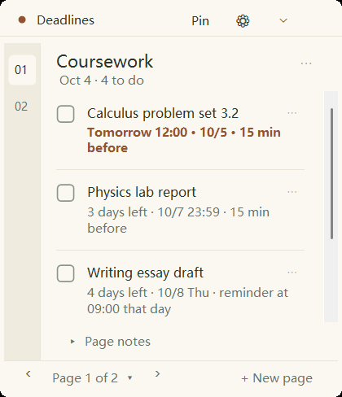

### Adding tasks

- **To-do**: type in the box at the end of the list and press Enter; keep typing to add more.
- **Deadlines**: type, press Enter, and the due-time picker opens. Pick a date (and a time if needed) and press Enter again. Press Enter right away to add the task without a due time.

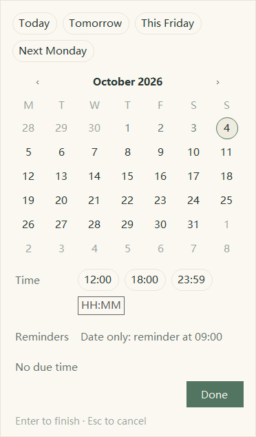

In the picker:

- The top row offers today, tomorrow, this Friday, next Monday and the last date you used.
- A date without a time means "due that day": you get one reminder that morning, at 09:00 unless you change it under **Settings → Reminders**.
- With a time, you can also choose how long before to be reminded.
- Keyboard: arrow keys pick the date, Enter confirms, Esc cancels.

### Changing tasks

- **Text**: double-click a task to edit it where it is. Enter saves, Shift+Enter adds a new line, Esc cancels. Clicking anywhere outside the box (blank space, another task, the header) or switching to another program also saves.

  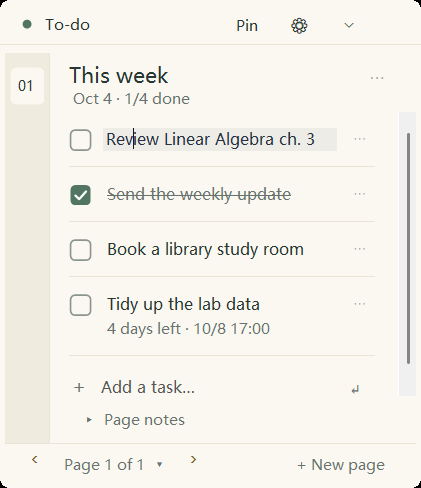

- **Due time**: click the small line under the task, e.g. "Tomorrow 12:00". On a To-do task, hover and click **+ Due time**.
- **Everything else** (full editor, delete, move up or down): the `⋯` menu at the right of the task.

### Done and order

- Tick the box to mark a task done; click again to undo.
- **Deadlines are sorted by due time**: the earliest (and anything overdue) first, tasks without a due time after them, done tasks at the bottom. A new task moves to its place and is briefly highlighted. To arrange them yourself, turn off **Sort deadlines by due time** under **Settings → Notebooks and pages**; your own order comes back.

### Pages

- A notebook can have many pages. Use `‹` `›` at the bottom to turn pages and **+ New page** to add one; click the page number to jump to any page.
- Click a page title to rename it. **Page notes** opens a short free-text note for the page.
- Pages you no longer need can be archived under **Settings → Notebooks and pages**. Archived pages leave the page list, but their content and reminders stay; unarchive them any time.

---

## 6. Reminders

- A task with a due time is reminded at its lead time and again when it is due.
- A date-only task is reminded once that morning, at 09:00 by default.
- Outlook events are reminded 15 minutes before they start by default, if you subscribe to one.
- Done tasks are not reminded. Hidden widgets, other pages and archived pages are still checked.
- DeskStudy must be running to remind you, so consider **Start when I sign in to Windows**. Reminders missed while the computer slept or DeskStudy was closed arrive together the next time it runs.
- **Settings → Reminders** sets the default lead time, the time for date-only tasks, quiet hours and the sound, sends a test notification, and lists all unfinished tasks with a due time.

Reminders are Windows notifications. If none appear, check Windows **Notifications** settings and **Do not disturb**.

---

## 7. Appearance and language

Under ⚙ → **Appearance → Notebook layout**, click a card to switch both notebooks. The five layouts, from left to right: Original, Light cards, Paper, Clean cards, Journal.

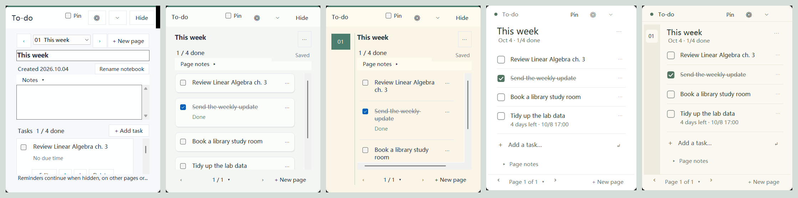

| Layout | What it is like |
| --- | --- |
| Original | Every button in view; edit, move and delete under each task. |
| Light cards | The default. Each task is a small card. |
| Paper | Warm paper with page numbers down the left. |
| Clean cards | White, a large title, hairlines between tasks. The simplest. |
| Journal | Cream paper with narrow page tabs, like a notebook. |

- The calendar follows the notebooks: Light and Clean cards give it a clean look, Paper and Journal a paper look; Original keeps the original calendar.
- The same page sets the theme (light or dark), background color, opacity and font size, for all widgets or one at a time.
- Rounded or square corners: **Settings → Display and layout → Corners**.
- **Language**: **Language · 界面语言** at the top of **Appearance**. Choose English or 中文 and click **Restart now · 立即重启**. What you write is never translated.

---

## 8. Settings

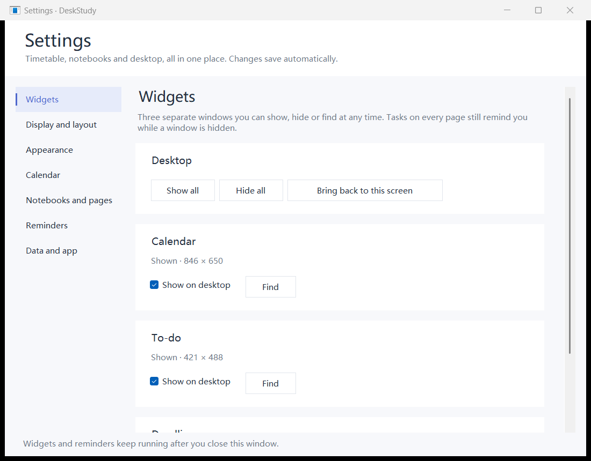

| Page | What you can do there |
| --- | --- |
| Widgets | Show or hide each widget; bring back widgets that are off screen. |
| Display and layout | Window mode, corners, the taskbar button, the shortcut; exact positions and sizes, locking a widget in place, saving and restoring an arrangement. |
| Appearance | Language, notebook layout, theme, background color, opacity, font size. |
| Calendar | Default view, first day of the week, term dates, deadlines on the calendar, the Outlook calendar, and all course series. |
| Notebooks and pages | Notebook names, deadline order; manage, reorder and archive pages. |
| Reminders | Default lead time, date-only reminder time, quiet hours, sound, test notification, and the list of unfinished tasks with a due time (double-click one to open its page). |
| Data and app | Export, import, backups and restore; starting with Windows. |

Changes apply at once and save automatically. Closing Settings leaves the widgets running.

---

## 9. Data, backups and updates

- Everything saves automatically.
- Your data lives in `%LOCALAPPDATA%\DeskStudy` (paste that into the File Explorer address bar). A subscribed Outlook calendar is cached in `outlook-cache.json` in the same folder.
- **Back up**: **Settings → Data and app → Back up now**. DeskStudy also backs up by itself before importing, restoring a backup or copying an Outlook calendar.
- **New computer**: **Export all data…** on the old one, **Import data…** on the new one. Importing replaces what is on the new computer.
- **Note**: exports and backups include your Outlook link; keep that in mind before sharing those files.
- **Updating**: right-click the tray icon → **Save and exit**, then start the new `DeskStudy.exe`. Your content carries over.

---

## 10. Questions

**The widgets are gone.**
Usually they are behind other windows. Click the DeskStudy taskbar button or tray icon, or press `Ctrl+Alt+Shift+D`. Double-click the tray icon to show hidden widgets. Still missing? **Settings → Widgets → Bring back to this screen**.

**After Win+D (show desktop) the widgets disappeared too.**
They were minimized with everything else; bring them back the same way.

**Did ✕ close the program?**
No, it hides that widget. To quit, right-click the tray icon → **Save and exit**.

**I got no reminder.**
Check that DeskStudy is running, the task has a due time and is not ticked, Windows notifications and Do not disturb, and the quiet hours under **Settings → Reminders**.

**I cannot move a widget.**
It may be locked: unlock it under **Settings → Display and layout**.

**My Outlook events are not updating.**
Look at the last sync time and any message on the Outlook card. "Calendar not found" usually means the link was not copied in full or the calendar is no longer published. If syncing works but the content is old, Microsoft has not updated the published calendar yet; try again later.

**After moving the program folder it no longer starts with Windows.**
Start it from the new folder, then untick and tick **Start when I sign in to Windows** again.

**Does DeskStudy upload my data?**
No. Your courses, tasks and settings stay on this computer. If you subscribe to an Outlook calendar, DeskStudy only downloads from the link you gave it; it never uploads anything.
