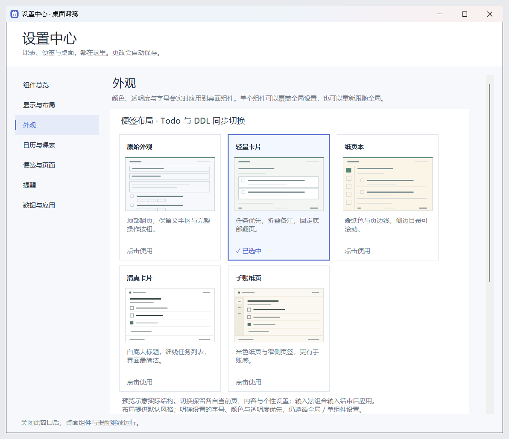
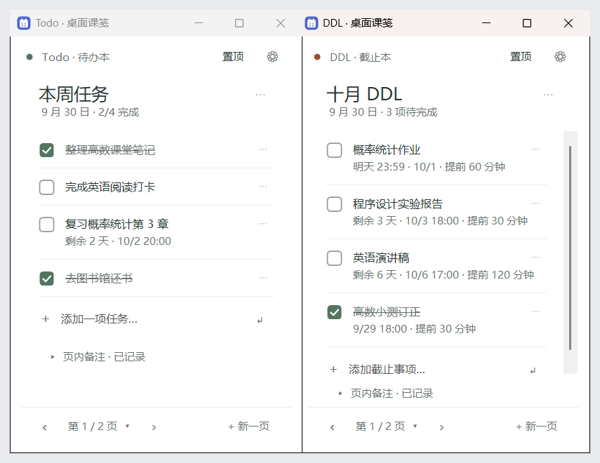
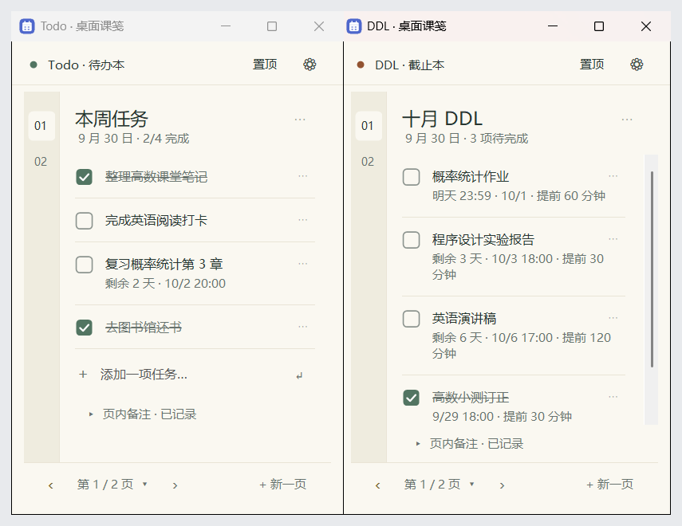
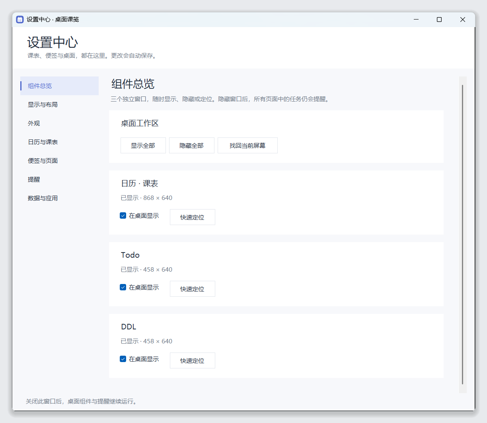

# 桌面课笺 使用指南

桌面课笺是一个放在 Windows 桌面上的小工具，由三个可以同时显示的窗口组成：

- **日历 · 课表**：按周或按月看课程，支持每周、每两周循环的课。
- **Todo 便签**：记要做的事，做完打勾。
- **DDL 便签**：记有截止时间的事，到时间会提醒。

所有内容只保存在你自己的电脑上，不联网，不需要注册账号。

## 1. 开始使用

1. 把压缩包解压到一个固定的文件夹，比如 `D:\桌面课笺`。不要直接在压缩包里运行。
2. 双击 `DeskStudy.exe`。不需要安装，也不需要管理员权限。
3. 第一次打开是空白的课表和两本空便签，直接开始用就行。

几点说明：

- 需要 Windows 10 或 Windows 11。
- 如果 Windows 弹出「Windows 已保护你的电脑」，点「更多信息」→「仍要运行」。出现这个提示是因为程序没有购买数字签名，不代表有问题。
- `DeskStudy.exe.config` 要和 `DeskStudy.exe` 放在同一个文件夹里，不要删。

## 2. 三个窗口的基本操作

三个窗口是桌面小组件：没有标题栏，也不出现在任务栏和 Alt+Tab 里。

- **移动**：按住窗口顶部那一栏拖动。
- **调整大小**：把鼠标移到窗口的边缘或四个角，光标变成双向箭头后拖动。
- **松手后自动整理**：拖动过程中窗口完全跟着鼠标走，松开鼠标后才会做下面这些：
  - **贴齐**：离屏幕边缘或另一个窗口 10 像素以内，自动贴上去。贴着另一个窗口时，两者之间留 5 像素的缝。
  - **弹回**：超出屏幕顶部，一定会滑回来。超出左、右、下边（包括拖进任务栏）不多时，也会滑回屏幕边缘；超出得多，就留在原处，方便你把不常看的窗口推到屏幕边上。不管推出去多远，都会留一截在屏幕上，方便拖回来。
  - **不重叠**：压住了另一个窗口一部分时，你刚拖的这个滑到最近的空位，被压住的不动。如果是故意叠上去的（盖住了较小那个窗口的 一半以上），就允许叠着放。锁定位置的窗口不会被挪。
  - **拉伸**：拉大窗口时撞到另一个窗口，被拉的那条边会停在它前面。
- **隐藏**：点「隐藏」。清爽卡片和手账纸页外观下，鼠标移到窗口上时右上角会出现 ✕，点它隐藏。只是收起来，程序还在运行，提醒照常。
- **折叠**：点 ⚙ 右边的 ⌄（或双击顶栏），窗口收成一条顶栏，沉到任务栏上方。正下方有别的窗口时，会沿着底边滑到旁边的空位；折叠后的顶栏可以沿底边左右拖动，往上拖松手会回到底部。点 ⌃（或再双击顶栏）展开，回到折叠前的位置。折叠状态不保存，重新打开程序时窗口都是展开的。
- **圆角 / 直角**：设置中心 →「显示与布局」→「组件四角」可以选。平时窗口没有阴影，拖动时才有。
- **置顶**：勾选「置顶」，这个窗口会一直显示在其他窗口上面。
- **打开设置**：点任意窗口上的 ⚙，或者右键托盘图标选「设置中心」。
- **彻底退出**：右键任务栏右下角托盘里的桌面课笺图标，选「保存并退出」。图标没显示时，先点托盘区的 `^`。

每个窗口的位置、大小、是否置顶都会自动记住，下次打开还是原样。

**组件平时待在其他窗口下面**

- 点一下组件，它浮到最前面，可以正常操作。
- 切到别的程序后，它自动回到其他窗口下面，不挡着你工作。
- 勾了「置顶」的组件不受影响，一直在最上面。
- 开机自动启动时，组件安静地出现在其他窗口下面，不会打断你正在做的事。

**组件被别的窗口挡住时，把它叫到前面**

- 单击托盘里的桌面课笺图标。
- 或者按快捷键 `Ctrl+Alt+Shift+D`。再按一次，组件收回去。快捷键可以在 设置中心 →「显示与布局」里修改或停用。

被你隐藏的组件不会因此出现。想把隐藏的组件全部显示出来，双击托盘图标。

**不喜欢这种方式？** 在 设置中心 →「显示与布局」→「窗口模式」里选「标准窗口」，三个组件就变回带标题栏的普通窗口，也会出现在任务栏里。

## 3. 日历与课表

**添加课程**

1. 点「+ 添加日程」，或者在日历空白处双击。
2. 填写名称、日期、开始和结束时间，需要的话再填地点、备注，选一个颜色。
3. 要每周上的课，在「重复」里选「每周」（或「每两周」），勾上一周里上课的那几天，再填「循环截止」日期。

**修改或删除**

- 点一下已有的课程就能修改或删除。
- 循环课程会问你改「仅这一次」还是「整个系列」。某一节临时停课或调课，选「仅这一次」，其他周不受影响。

**查看**

- 「工作周」「周」「月」切换视图：工作周只显示周一到周五，每列更宽，课程名能完整显示。「‹」「›」翻到上一段、下一段，「今天」回到今天。
- 日历会记住你上次选的视图，下次打开还是它。

建议先到 设置中心 →「日历与课表」填好学期起止日期和教学第 1 周，之后新建课程会自动带上这些日期，日历上也会显示当前是教学第几周。

## 4. Todo 与 DDL 便签

两本便签的内容互相独立。Todo 记要做的事，DDL 记有截止时间的事。

**添加 Todo 任务**：在列表最下面的输入框里打字，按回车就添加了，可以连续输入。

**添加 DDL 任务**：

1. 在输入框里打字，按回车，会弹出截止时间面板。
2. 在面板里点日期。只有某一天截止就只选日期；需要具体时间再点时间。
3. 再按一次回车（或点「完成」），任务就添加好了。

- 不想设截止时间：弹出面板后什么都不选，直接再按一次回车。任务会显示「未设置截止时间」，之后点一下这行字就能补。
- 想先选时间再打字：点输入框右边的「+ 截止时间」，选好后再回车。
- 按 Esc 或点面板外面是取消，任务不会添加，打的字还在。

**修改截止时间**：直接点任务下面那行灰色小字，比如「未设置截止时间」或「明天 23:59 · 10/1」，会弹出同一个面板。面板里可以改日期、时间、提前多久提醒，也可以清除截止时间。

**给 Todo 任务加截止时间**：鼠标移到任务上，右边会出现「+ 截止时间」，点它即可。

**截止时间面板**

- 上面一排是常用日期：今天、明天、本周五、下周一，以及你上次用过的日期。
- 「时间」一行是常用时间，也可以在小框里直接输入，比如 `18:30`。上次用过的时间也会出现在这里。
- 只选日期、不选时间：任务显示为当天截止，在当天上午 9:00 提醒一次。这个时间可以在 设置中心 →「提醒」里改。
- 选了时间：可以再选提前多久提醒。
- 键盘操作：方向键选日期，回车完成，Esc 取消。

**完成任务**：点任务前面的方框打勾。完成的任务会留在原处，再点一次可以取消。

**调整顺序、删除、修改任务文字**：在任务右边的 `⋯` 里。

**页面**

- 一本便签可以有很多页。窗口底部的「‹」「›」翻页，「+ 新页」新建一页。
- 点页码可以打开页面目录，直接跳到某一页。
- 点页面标题就能直接改名。
- 「页内备注」点开后可以写一段文字，比如这一页的说明。

**归档**：用不到的旧页面，可以在 设置中心 →「便签与页面」里归档。归档的页面不再出现在翻页里，但内容和提醒都还在，随时可以取消归档。

## 5. 提醒

- 给任务设置了截止时间，就会提醒：提前时间到了提醒一次，截止时间到了再提醒一次。
- 只设了日期、没设具体时间的任务：在当天上午 9:00 提醒一次。如果是当天 9:00 之后才设置的"今天截止"，不再提醒。
- 任务打勾完成后不再提醒。
- 窗口隐藏了、翻到别的页、页面归档了，提醒都不受影响。
- 想要提醒，程序必须在运行。建议在 设置中心 →「数据与应用」里勾选「登录 Windows 后自动启动」。
- 电脑休眠或程序没开时错过的提醒，会在下次运行时汇总补发。
- 设置中心 →「提醒」里可以设置免打扰时段、提醒声音，也能看到所有还没完成的截止任务。

提醒通过 Windows 的系统通知显示。如果完全看不到通知，检查 Windows 的「通知」设置和「勿扰模式」。

## 6. 更换便签外观

点任意窗口的 ⚙ →「外观」→「便签布局」，点一张卡片就能切换，两本便签会一起变。一共五种：

| 布局 | 特点 |
| --- | --- |
| 原始外观 | 按钮最全，翻页在顶部，每个任务下面直接有编辑、移动、删除按钮。 |
| 轻量卡片 | 默认外观。每个任务是一张小卡片，翻页在底部。 |
| 纸页本 | 暖色纸张，左边有一列页码，点页码直接翻页。 |
| 清爽卡片 | 白底，大标题，任务之间只有细线，最简洁。 |
| 手账纸页 | 米色纸页，左边是窄页签，更像笔记本。 |

清爽卡片：

手账纸页：

清爽卡片和手账纸页的顶部没有「隐藏」按钮：鼠标移到窗口上时，右上角会出现 ✕，点它隐藏。

日历的外观跟着便签布局走：选轻量卡片或清爽卡片时，日历是清爽风格；选纸页本或手账纸页时，日历是米色纸页风格；选原始外观时，日历保持原来的样子。清爽和纸页风格的日历顶部更紧凑，同样高度能看到更多课程时间。

切换外观不会丢任何内容：当前页、任务、备注、窗口位置都保持不变。

同一页里还可以调整主题（浅色／深色）、背景颜色、透明度和字号。可以三个窗口一起调，也可以只调其中一个。

## 7. 设置中心

| 页面 | 可以做什么 |
| --- | --- |
| 组件总览 | 显示或隐藏三个窗口，找回跑到屏幕外的窗口。 |
| 显示与布局 | 窗口模式（桌面组件／标准窗口）和快捷键；精确设置窗口位置和大小，锁定位置防止误拖，保存和恢复一套窗口摆放。 |
| 外观 | 便签布局、主题、背景色、透明度、字号。 |
| 日历与课表 | 默认视图、一周从周几开始、学期日期，管理所有课程。 |
| 便签与页面 | 给两本便签改名，管理、排序、归档页面。 |
| 提醒 | 默认提前时间、免打扰、声音、测试通知。 |
| 数据与应用 | 导出、导入、备份、恢复，登录 Windows 后自动启动。 |

所有设置改完立即生效并自动保存。关掉设置中心不会关掉桌面上的窗口。

## 8. 数据与备份

- 内容是自动保存的，不需要手动保存。
- 数据保存在 `%LOCALAPPDATA%\DeskStudy` 文件夹（把这一串粘贴到文件资源管理器的地址栏就能打开）。
- **备份**：设置中心 →「数据与应用」→「立即备份」。
- **换电脑**：在旧电脑上点「导出全部数据…」得到一个文件，拷到新电脑后点「导入数据…」读入。导入会替换新电脑上的现有内容，导入前程序会自动留一份备份。
- **升级新版本**：先右键托盘图标「保存并退出」，再打开新版本的 `DeskStudy.exe`，原来的内容会自动带过来。

## 9. 常见问题

**窗口不见了？**
多半是被别的窗口挡住了：单击托盘图标，或按 `Ctrl+Alt+Shift+D`，组件会浮到最前面。如果是之前隐藏了，双击托盘图标会显示全部窗口。还是看不到的话，右键托盘图标 →「设置中心」→「组件总览」→「找回当前屏幕」。

**任务栏上为什么没有它？**
桌面组件模式下，三个组件不占任务栏，只在托盘里有一个图标。想要任务栏按钮，可以在「显示与布局」里切换到「标准窗口」。

**按 Win+D（显示桌面）后组件也不见了？**
组件可能会和其他窗口一起被收起来。单击托盘图标，或按 `Ctrl+Alt+Shift+D`，就能把它们叫回来。

**托盘里找不到图标？**
点任务栏右下角的 `^` 展开隐藏的图标。如果确实没有，说明程序没在运行，重新双击 `DeskStudy.exe`。

**点 ✕ 之后程序关了吗？**
没有，只是隐藏了窗口。要彻底退出，右键托盘图标选「保存并退出」。

**为什么没有收到提醒？**
确认程序在运行、任务设置了截止时间而且没有打勾，再检查 Windows 的通知设置、勿扰模式，以及设置中心「提醒」里的免打扰时段。

**拖不动窗口？**
可能开了位置锁定。到 设置中心 →「显示与布局」里取消该窗口的锁定。

**移动了程序文件夹之后，开机不自动启动了？**
在新位置打开程序，到「数据与应用」里把「登录 Windows 后自动启动」取消勾选，再重新勾选一次。

**会不会上传我的数据？**
不会。程序不联网，所有内容只在本机的数据文件夹里。
