# 桌面课笺 使用指南

[English version](USER_GUIDE.en.md)

桌面课笺是一个常驻 Windows 桌面的小工具，由三个组件组成：

- **日历 · 课表**：按工作周、周或月查看课程，支持每周、每两周循环的课、全天日程，也可以把 Outlook 日历同步进来。
- **Todo 便签**：记录要做的事，做完打勾。
- **DDL 便签**：记录有截止时间的事，按截止时间自动排序，到时间会提醒，也会显示在日历上。

内容只保存在你自己的电脑上，不需要注册账号。程序默认不联网，只有你订阅了 Outlook 日历时，才会去下载那一个日历。

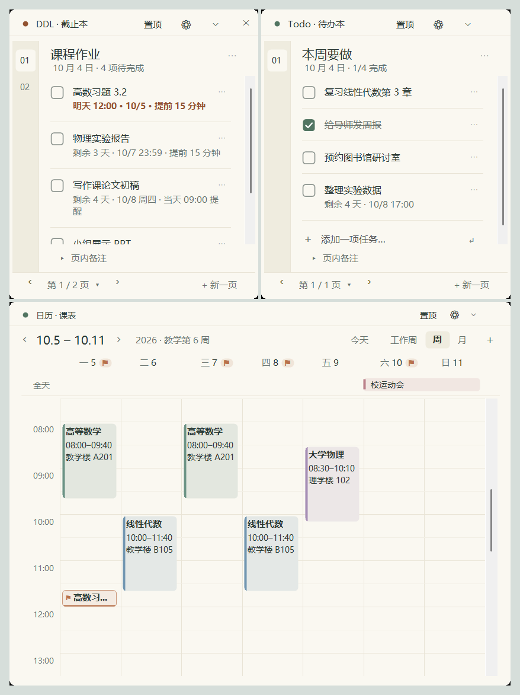

---

## 1. 安装与启动

1. 把压缩包解压到一个固定的文件夹，比如 `D:\桌面课笺`。不要直接在压缩包里运行。
2. 双击 `DeskStudy.exe`。不需要安装，也不需要管理员权限。
3. 第一次打开时，课表是空的，两本便签也是空的，直接开始用就行。稍后会弹出一个小窗口，问你要不要「在桌面创建快捷方式」和「添加到开始菜单」，勾好点「好的」。

- 需要 Windows 10 或 Windows 11。
- 如果出现「Windows 已保护你的电脑」，点「更多信息」→「仍要运行」。程序没有购买数字签名，所以会出现这个提示，并不代表有问题。
- `DeskStudy.exe.config` 要和 `DeskStudy.exe` 放在同一个文件夹里，不要删。
- 想开机自动打开：设置中心 →「数据与应用」→ 勾选「登录 Windows 后自动启动」。
- 快捷方式以后也能改：设置中心 →「显示与布局」→「快捷方式」。把程序文件夹挪到别处后，下次启动时快捷方式会自动指向新位置。直接在压缩包里打开时不会创建快捷方式，因为那只是一份临时副本。

---

## 2. 组件的基本操作

### 移动和调整大小

- **移动**：按住组件最上面那一栏拖动。
- **调整大小**：鼠标移到边缘或四个角，光标变成双向箭头后拖动。
- **松手后自动整理**。拖动过程中组件完全跟着鼠标走，松开后才会：
  - **贴齐**：离屏幕边缘或另一个组件不到 10 像素时自动贴上，组件之间留 5 像素的缝。
  - **滑回**：超出屏幕顶部一定会滑回；超出左、右、下边（包括任务栏）不多时，也会滑回屏幕边缘。超出得多就留在原处，但至少会留一截在屏幕上，方便拖回来。
  - **让开**：压住另一个组件时，刚拖的这个会滑到旁边的空位。如果是有意叠放（盖住了较小那个的一半以上），就保持叠着。
- 位置和大小会自动记住，下次打开还是原样。

### 隐藏、折叠、置顶

- **隐藏**：点右上角的 ✕（原始外观里是「隐藏」按钮）。只是收起来，程序和提醒照常运行。
- **折叠**：点 ⚙ 右边的 ⌄，或者双击顶栏。组件会收成一条顶栏，停在屏幕底部（任务栏上方）。点 ⌃ 或再次双击，就回到原来的位置。重新打开程序时，组件都是展开的。

  

- **置顶**：点「置顶」，这个组件会一直显示在其他窗口上面。

### 组件平时待在其他窗口下面

点一下组件，它就浮到最前面；切换到别的程序后，它会自动回到其他窗口下面，不挡着你工作（置顶的组件除外）。需要看它时，有三种方法叫到前面：

- 单击任务栏上的「桌面课笺」按钮。组件已经在前面时，再单击一次会收回去。右键这个按钮选「固定到任务栏」，以后程序没打开时也能从这里启动。
- 单击屏幕右下角托盘里的桌面课笺图标。双击托盘图标会把隐藏的组件全部显示出来。
- 按快捷键 `Ctrl+Alt+Shift+D`，再按一次收回去。快捷键可以在 设置中心 →「显示与布局」里修改或停用。

不喜欢这种方式的话，可以到 设置中心 →「显示与布局」把窗口模式改成「标准窗口」，三个组件就会变成普通窗口，带标题栏，也各自出现在任务栏上。

### 其他

- **打开设置中心**：点任意组件上的 ⚙，或者右键托盘图标 →「设置中心」。
- **彻底退出**：右键托盘图标 →「保存并退出」。托盘图标被收起来时，先点任务栏右下角的 `^`。

---

## 3. 日历与课表

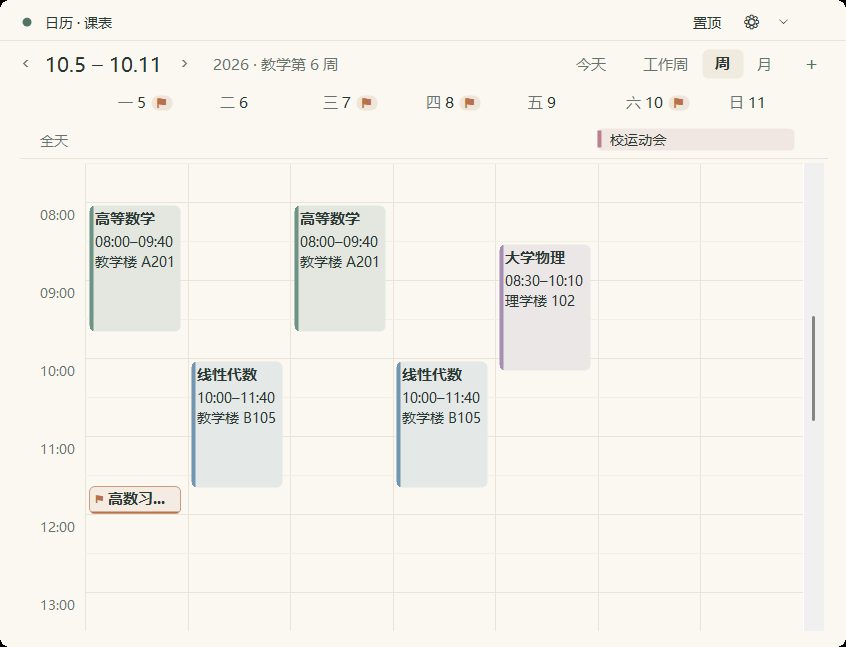

### 查看

- 右上角可以在「工作周」（周一到周五，每列更宽）、「周」、「月」之间切换，日历会记住你上次选的视图。
- 「‹」「›」翻到上一周或下一周（月视图下是上一月或下一月），「今天」回到今天。
- 周视图里，日程名称会完整显示，放不下就自动换行。日程块太窄时，鼠标停在上面能看到全部内容。

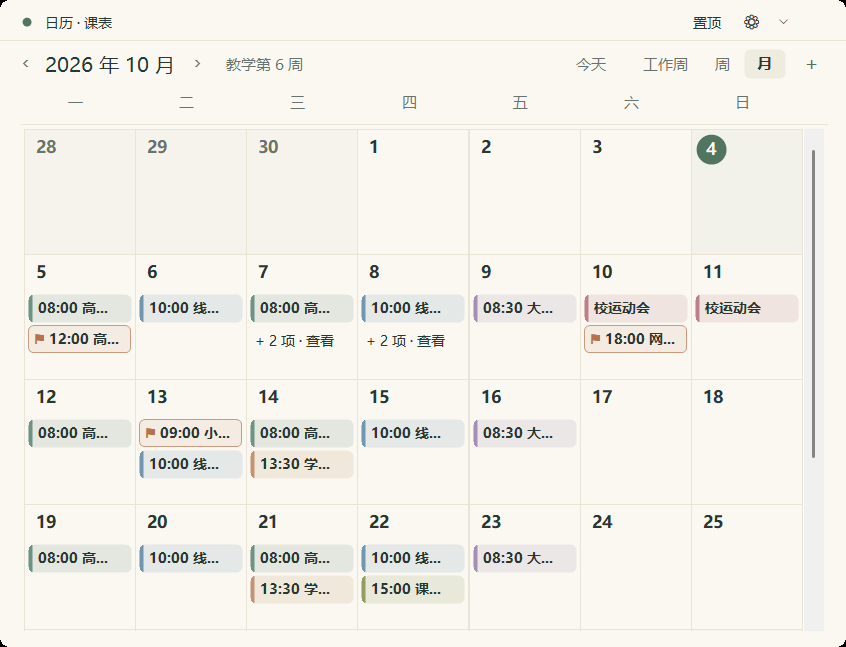

### 添加和修改课程

1. 在空白的时间格上双击，或者点右上角的「＋」。
2. 填写名称、日期、时间、地点和备注，选一个颜色。颜色列表里有 6 种常用色、日历里其他日程正在用的颜色（显示为「同「某日程」」），以及「自定义颜色…」。
3. 每周都上的课：「重复」选「每周」或「每两周」，勾选上课的星期几，再填「循环截止」日期。

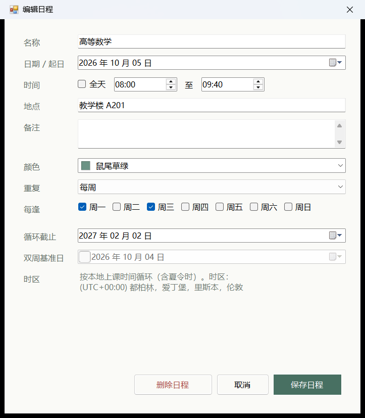

- 单击已有的课程就能修改或删除。修改循环课程时，会问你改「仅这一次」还是「整个系列」。某节课临时停课或调课，选「仅这一次」，其他周不受影响。
- 建议先到 设置中心 →「日历与课表」填好学期起止日期和教学第 1 周。之后新建课程时会自动带上这些日期，日历顶部也会显示当前是教学第几周。

### 全天日程

假期、运动会、考试周这类占满一整天的安排，用全天日程：

- 在周视图里双击某一天的日期，就能新建当天的全天日程。也可以在编辑框里勾选「全天」，再填写共几天。
- 全天日程显示在星期行下面的「全天」一行，跨几天就是一条连起来的长条，跨周的会在下一周继续显示。
- 全天日程也可以每周或每两周重复。

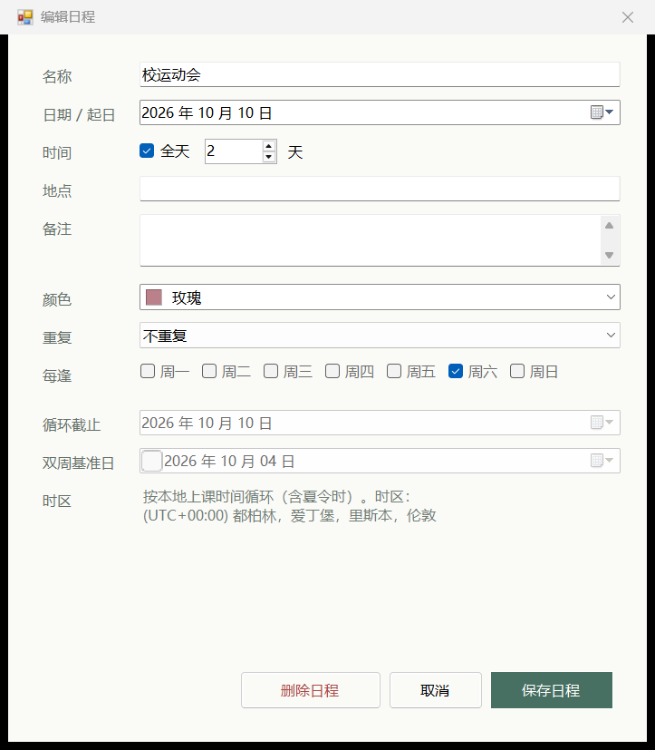

### DDL 也会显示在日历上

- DDL 便签里没完成、设了截止时间的任务，会以带「⚑」的小标签显示在日历上，标签的下边缘就是截止时刻。截止时间挨得很近的几条会合成一个「⚑ N 项截止」。
- 只要某天有 DDL，那天的日期旁边就会出现「⚑」角标，有几条就显示几。鼠标停上去能看到具体是哪几件事。
- 单击日历上的 DDL：DDL 便签会翻到对应的那一页，并把这条任务高亮一下。双击：直接打开编辑框。
- 不想在日历上看到 DDL：设置中心 →「日历与课表」，关掉「在日历上显示 DDL 截止时间」。

---

## 4. 把 Outlook 日历显示进来

学校或公司的 Microsoft 365 日历可以只读同步到桌面课笺。

**第一步：在 Outlook 里拿到链接**

1. 在浏览器里打开 Outlook 网页版，进入 设置 → 日历 → 共享日历，找到「发布日历」。（不是「共享日历」那个按人共享的功能。）
2. 选择你的日历，权限选「可查看所有详细信息」，点「发布」，复制 **ICS** 链接。

**第二步：填进桌面课笺**

设置中心 →「日历与课表」→「Outlook 日历（只读）」，粘贴链接，点「保存并同步」。几秒后，下面会显示上次同步的时间和日程数量。

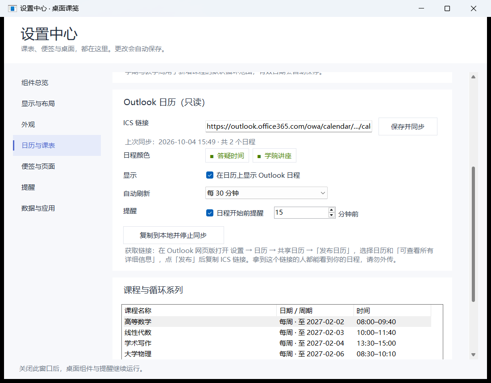

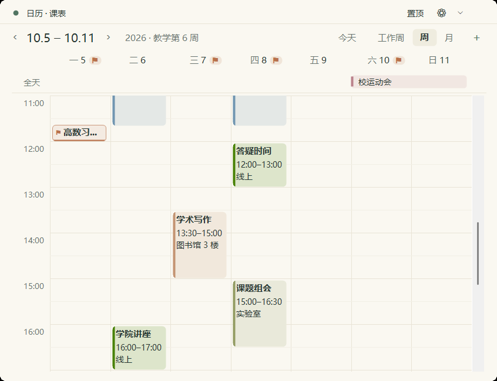

- **颜色**：Outlook 发布的链接里不带颜色，所以程序按日程名称给每种日程配一种颜色，同名的日程颜色相同。想和 Outlook 里一样，可以在「日程颜色」里点对应的色块去改，也可以单击日历上的那个日程，选「更改这个日程的颜色」。
- **只读**：在这里不能修改 Outlook 的日程，单击只会显示详情。要改请回到 Outlook 里改。
- **刷新**：默认每 30 分钟同步一次，可以改成每 15、60 或 120 分钟。Outlook 里的修改，需要等微软更新发布的日历后，才会出现在链接里。
- **提醒**：默认在日程开始前 15 分钟提醒，可以修改或关闭。
- **断网**：会照常显示上一次同步到的内容。
- **安全**：这个链接相当于一把钥匙，拿到它的人都能看到你的日程，不要发给别人。

**想把 Outlook 日程变成自己的、以后不再同步？**
点「复制到本地并停止同步」。程序会先告诉你会生成多少个循环课程和单次日程，确认后才复制：

- 每周固定的课变成循环课程，缺的那几周记为停课；
- 单独改过的那一次课，以及不规律的日程，变成单次日程；
- 全天日程变成全天日程，颜色保持不变。

复制前会自动备份。复制完成后停止同步，也不再显示 Outlook 日历。只会复制已经同步到的范围（今天前 35 天到今后 200 天）。如果想调整颜色，最好在复制之前调好。

---

## 5. Todo 与 DDL 便签

两本便签的内容互相独立：Todo 记要做的事，DDL 记有截止时间的事。

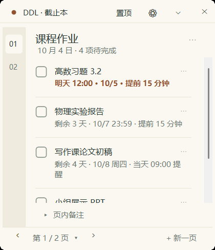

### 添加任务

- **Todo**：在列表最下面的输入框里打字，按回车就添加了，可以连续输入。
- **DDL**：打字后按回车，会弹出截止时间面板。选好日期（需要的话再选时间），再按一次回车，就添加好了。不想设截止时间的话，弹出面板后直接再按一次回车。

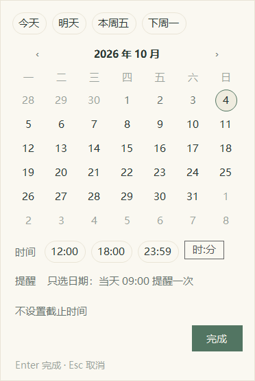

截止时间面板：

- 上面一排是常用日期：今天、明天、本周五、下周一，以及你上次用过的日期。
- 只选日期、不选时间：表示当天截止，当天上午 9:00 提醒一次（这个时间可以在设置中心「提醒」里改）。
- 选了时间：可以再设置提前多久提醒。
- 键盘操作：方向键选日期，回车完成，Esc 取消。

### 修改任务

- **改文字**：双击任务文字，就能直接在原处修改。按 Enter 保存，Shift+Enter 换行，Esc 取消。点一下输入框以外的任何地方（空白处、别的任务、顶栏都行），或者切到别的程序，也会保存。

  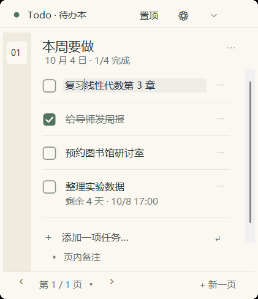

- **改截止时间**：点任务下面那行小字，比如「明天 12:00」。Todo 任务把鼠标移上去，会出现「+ 截止时间」。
- **完整编辑、删除、调整顺序**：在任务右边的 `⋯` 菜单里。

### 完成和排序

- 点任务前面的方框打勾即完成，再点一次可以取消。
- **DDL 自动按截止时间排序**：最早截止的在最上面（已过期的最先），没设截止时间的排在后面，完成的在最下面。新加的任务会排到它该在的位置，并高亮一下。想自己排顺序，可以在 设置中心 →「便签与页面」关掉「DDL 按截止时间排序」，原来手动排好的顺序会恢复。

### 页面

- 一本便签可以有很多页。用底部的「‹」「›」翻页，「+ 新一页」新建一页；点页码可以打开目录，直接跳到某一页。
- 点页面标题可以直接改名。「页内备注」点开后可以写一段文字。
- 用不到的旧页面，可以在 设置中心 →「便签与页面」里归档。归档的页面不会出现在翻页里，但内容和提醒都还在，随时可以取消归档。

---

## 6. 提醒

- 设了截止时间的任务：到了提前提醒的时间提醒一次，到截止时间再提醒一次。
- 只设了日期的任务：在当天上午 9:00 提醒一次。
- 订阅了 Outlook 时，Outlook 日程默认在开始前 15 分钟提醒。
- 任务打勾完成后，就不再提醒。隐藏组件、翻到别的页、页面归档，都不影响提醒。
- 程序必须在运行才能提醒，建议开启「登录 Windows 后自动启动」。电脑休眠或程序没开时错过的提醒，会在下次运行时汇总补发。
- 设置中心 →「提醒」里可以设置默认提前时间、免打扰时段和提醒声音，也可以发一条测试通知。

提醒通过 Windows 的系统通知显示。如果完全看不到，请检查 Windows 的「通知」设置和「勿扰模式」。

---

## 7. 外观与语言

点任意组件的 ⚙ →「外观」→「便签布局」，点一张卡片就能切换，两本便签会一起变。一共有五种布局，从左到右依次是：原始外观、轻量卡片、纸页本、清爽卡片、手账纸页。

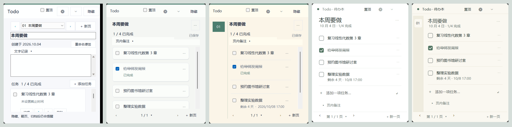

| 布局 | 特点 |
| --- | --- |
| 原始外观 | 按钮最全，每个任务下面直接有编辑、移动、删除按钮。 |
| 轻量卡片 | 默认布局。每个任务是一张小卡片。 |
| 纸页本 | 暖色纸张，左边有一列页码。 |
| 清爽卡片 | 白底、大标题，任务之间只有细线，最简洁。 |
| 手账纸页 | 米色纸页，左边是窄页签，更像笔记本。 |

- 日历的风格会跟着便签布局变：轻量卡片、清爽卡片对应清爽风格；纸页本、手账纸页对应纸页风格；原始外观保持原样。
- 同一页里还可以调整主题（浅色／深色）、背景颜色、透明度和字号，可以三个组件一起调，也可以单独调某一个。
- 组件四角可以选圆角或直角：设置中心 →「显示与布局」。
- **界面语言**：设置中心 →「外观」最上面的「界面语言 · Language」，选中文或 English 后点「立即重启」。你写的内容不会被翻译。第一次打开程序时，会跟随 Windows 的显示语言。

---

## 8. 设置中心

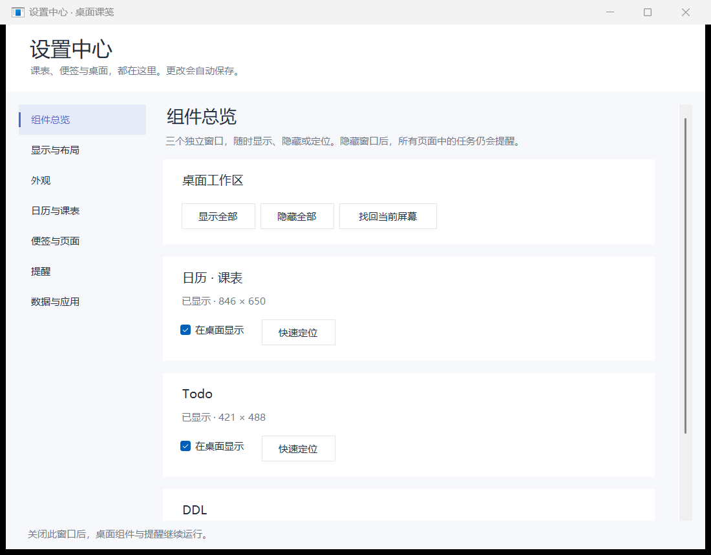

| 页面 | 可以做什么 |
| --- | --- |
| 组件总览 | 显示或隐藏三个组件，找回跑到屏幕外的组件。 |
| 显示与布局 | 窗口模式、组件四角、任务栏按钮、快捷键；精确设置位置和大小，锁定位置，保存和恢复一套摆放。 |
| 外观 | 界面语言、便签布局、主题、背景色、透明度、字号。 |
| 日历与课表 | 默认视图、一周从周几开始、学期日期、DDL 显示、Outlook 日历，管理所有课程系列。 |
| 便签与页面 | 改便签名称、DDL 排序，管理、排序、归档页面。 |
| 提醒 | 默认提前时间、只有日期的任务几点提醒、免打扰、声音、测试通知，以及所有未完成的截止任务列表（双击可打开所在页面）。 |
| 数据与应用 | 导出、导入、备份、恢复，开机自动启动。 |

所有设置修改后立即生效并自动保存。关掉设置中心不会关掉桌面上的组件。

---

## 9. 数据、备份与升级

- 内容会自动保存，不需要手动保存。
- 数据保存在 `%LOCALAPPDATA%\DeskStudy` 文件夹里（把这串文字粘贴到文件资源管理器的地址栏就能打开）。订阅 Outlook 时，下载下来的日历保存在同一个文件夹里的 `outlook-cache.json`。
- **备份**：设置中心 →「数据与应用」→「立即备份」。导入、恢复备份、复制 Outlook 日历之前，程序都会自动先备份一次。
- **换电脑**：在旧电脑上用「导出全部数据…」导出一个文件，在新电脑上用「导入数据…」导入。导入会替换新电脑上的现有内容。
- **注意**：导出的文件和备份文件里包含你填写的 Outlook 链接，分享这些文件之前要留意。
- **升级到新版本**：先右键托盘图标 →「保存并退出」，再打开新版本的 `DeskStudy.exe`，原来的内容会自动保留。

---

## 10. 常见问题

**组件不见了？**
多半是被别的窗口挡住了。单击任务栏上的「桌面课笺」按钮或托盘图标，或者按 `Ctrl+Alt+Shift+D`。如果之前隐藏了，双击托盘图标会全部显示出来。还是看不到的话：设置中心 →「组件总览」→「找回当前屏幕」。

**按 Win+D 显示桌面后，组件也不见了？**
组件可能和其他窗口一起被收起来了，用上面任意一种方法就能叫回来。

**点 ✕ 之后程序关了吗？**
没有，只是把组件隐藏了。要彻底退出，右键托盘图标 →「保存并退出」。

**为什么没有收到提醒？**
请依次确认：程序在运行；任务设置了截止时间、而且没有打勾；Windows 的通知设置和勿扰模式；设置中心「提醒」里的免打扰时段。

**拖不动组件？**
可能开了位置锁定，到设置中心 →「显示与布局」里取消锁定。

**Outlook 日程没有更新？**
先看设置中心里的「上次同步」时间和错误提示。「找不到这个日历」通常是链接没复制完整，或者已经取消了发布。如果同步正常但还是旧内容，是因为微软还没有更新发布的日历，稍后再看。

**移动了程序文件夹后，开机不自动启动了？**
在新位置打开程序，把「登录 Windows 后自动启动」先取消勾选，再重新勾选一次。

**会上传我的数据吗？**
不会。你的课程、任务和设置只保存在本机。只有订阅了 Outlook 时，程序才会访问你填写的那一个链接，而且只是下载，不会上传任何东西。
